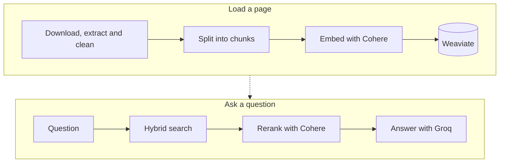

# Chat With Any Website

[](https://github.com/ayayousef2000/chat-with-any-website/actions/workflows/ci.yml)
[](LICENSE)
[](https://www.python.org/)

Paste the address of a web page, then ask questions about it. Answers come only from that page and carry numbered citations: click one to see the passage it is based on.

**Live demo: [chat-with-any-website-fnmo.onrender.com](https://chat-with-any-website-fnmo.onrender.com)**.

## Features

- **Grounded answers.** The model sees only excerpts of the page. When the page does not cover a question, it says so instead of guessing.
- **Citations you can check.** Each cited source shows the matching line or sentences with the matching words highlighted, and the full section is one click away.
- **Any language.** The answer is written in the language of the question. Tested on English and Arabic pages.
- **Kind to free plans.** Rate limits and short outages of the services are waited out, several Groq keys are used in turn, and each visitor has limits.
- **Light and dark themes.** The page follows the setting of your device, and a switch in the header lets you choose System, Light or Dark.
- **Private by design.** Stored pages are deleted automatically after a short time, or at once with **Delete data**.
- **Ready to deploy.** A Docker image, a Render blueprint and a `/health` endpoint are included.

## Contents

[Quick start](#quick-start) · [How it works](#how-it-works) · [Deploy](#docker) · [Evaluate](#evaluate) · [API](#api) · [Configuration](#configuration) · [Behaviour in detail](#how-sources-are-shown) · [Privacy](#privacy) · [Limitations](#limitations) · [Contributing](#contributing)

## Quick start

You need Python 3.14 or newer, [uv](https://docs.astral.sh/uv/), and API keys for [Cohere](https://dashboard.cohere.com/api-keys), [Weaviate Cloud](https://console.weaviate.cloud) (the free sandbox works; copy its REST endpoint and an API key) and [Groq](https://console.groq.com/keys).

```bash
uv sync
cp .env.example .env        # then fill in your keys
uv run uvicorn app.main:app --reload
```

Open http://127.0.0.1:8000, load a page, and start asking questions. [Node.js](https://nodejs.org/) 24 or newer (see `.nvmrc`) is only needed to run the tests of the page script.

## How it works



| Step | Module | Implementation |
|---|---|---|
| Website | `app/extraction.py` | `httpx` download with size limit, HTML-only, and blocking of private/local addresses |
| Content extraction | `app/extraction.py` | `trafilatura` keeps the main content as Markdown and drops navigation, ads and footers |
| Cleaning | `app/cleaning.py` | Unicode and whitespace normalization, footnote markup removal, duplicate paragraph removal |
| Chunking | `app/chunking.py` | Recursive paragraph → sentence → word splitting (about 2000 characters, 300 overlap); headings stay with their section |
| Embeddings | `app/embeddings.py` | Cohere `embed-v5.0-pro`; each chunk is embedded with its page title and section heading as a prefix (`search_document` for chunks, `search_query` for questions) |
| Vector database | `app/vector_store.py` | Weaviate Cloud collection with self-provided vectors, one set of chunks per URL |
| Retrieval | `app/vector_store.py` | Hybrid search (keyword + vector, relative score fusion) filtered by URL, 25 candidates |
| Reranking | `app/reranking.py` | Cohere `rerank-v4.0-fast` keeps the best 3 candidates (`TOP_K`) |
| LLM response | `app/llm.py` | `openai/gpt-oss-120b` on Groq, instructed to answer only from the retrieved excerpts |

`app/pipeline.py` ties the steps together, and `app/main.py` exposes them through a FastAPI app, with security headers (including a strict content security policy) and a web UI made of `app/static/index.html`, `styles.css` and `app.js`.

## Docker

The `Dockerfile` builds a small image with only the runtime dependencies, runs as an unprivileged user, and contains no settings: they come from environment variables (see [`.env.example`](.env.example)), and the `.env` file is kept out of the build by `.dockerignore`.

```bash
docker build -t chat-with-any-website .
docker run --rm -p 8000:8000 --env-file .env -v chat-data:/app/data chat-with-any-website
```

- The volume keeps the usage records of stored pages (`data/state.db`) when the container is replaced.
- Behind a proxy, add `-e FORWARDED_ALLOW_IPS=<the proxy's address>` so that each visitor's own address is used for the [limits per visitor](#limits-per-visitor). Without it, every visitor looks like the proxy.
- The image does not include the optional browser fallback for JavaScript-rendered pages.
- The base images are pinned to exact digests, and Dependabot proposes updates. CI builds the image and checks it on every pull request.

## Deploy on Render

[`render.yaml`](render.yaml) describes two web services for [Render](https://render.com). Both build the `Dockerfile`, run on the free plan in Frankfurt (close to a Weaviate Cloud cluster in `eu-central-1`), and use `/health` as their health check. The file holds no secrets.

| Service | Branch | Deploys when | Weaviate tenant |
|---|---|---|---|
| `chat-with-any-website` (production) | `main` | a release is merged into `main` | `production` |
| `chat-with-any-website-staging` | `develop` | any pull request is merged into `develop` | `staging` |

Both services use the same cluster and the same collection, each with its own **tenant** (see [Weaviate: one collection, one tenant per environment](#weaviate-one-collection-one-tenant-per-environment)). The two must never share a tenant: an app deletes the pages it finds in its tenant when nobody has asked about them for a while, so two services in one tenant would delete each other's pages.

1. In the Render dashboard choose **New**, then **Blueprint**, select this repository and the `main` branch. The Blueprint is linked to `main`, so a change to `render.yaml` takes effect after a release.
2. Render asks for the secrets of each service: `COHERE_API_KEY`, `WEAVIATE_URL`, `WEAVIATE_API_KEY`, `GROQ_API_KEY` and, if you have more than one Groq key, `GROQ_BACKUP_API_KEYS` (separated by commas). Any other setting from [`.env.example`](.env.example) can be added as an environment variable.
3. Wait for the build. When `/health` answers, Render makes the service live.

What to know about the free plan (from [Render's documentation](https://render.com/docs/free)):

- A free web service **spins down after 15 minutes without traffic** and takes about a minute to start again, so the first visitor after a quiet period waits.
- Free services **cannot have a persistent disk**, so the usage records of stored pages (`data/state.db`) are lost when the service restarts. Stored pages are found again in Weaviate on the next start.
- Each workspace gets **750 free instance hours** a month, shared by all its free services. A service that is asleep does not use hours, but two services that are both awake all month would use more than the 750.
- In a test with the largest page tried (112,000 characters), the app used at most 187 MB of memory.
- Render checks `/health` within a 5-second window; the endpoint answers at once and calls no outside service.
- Render sets the `PORT` variable, and the image listens on it.

The [limits per visitor](#limits-per-visitor) tell visitors apart by network address. On Render the app sees Render's proxy as the caller unless uvicorn is told which proxy addresses to trust, so by default all visitors are counted together.

## Weaviate: one collection, one tenant per environment

A free Weaviate Cloud plan allows **one collection and up to three tenants**. So the app keeps all its pages in one multi-tenant collection and gives every environment its own tenant, set with `WEAVIATE_TENANT`: for example `production` and `staging` on Render, and the default `local` on your own computer. Weaviate keeps tenants apart, so running the app or the evaluation on your computer cannot touch the pages of the live site. The app creates the collection and the tenant the first time it starts.

If the collection already exists **without** multi-tenancy (as it did before this setting existed), the app stops at startup and says so, because multi-tenancy cannot be switched on for an existing collection. The pages in it are only temporary copies, so delete the collection once in the [Weaviate console](https://console.weaviate.cloud) (open the cluster, then **Collections**, and delete `WebsiteChunk`) and start the app again: it creates the collection again with multi-tenancy. Do this before starting a new version of a live service, because the old version stops working while the collection is missing.

## Evaluate

`eval/run_eval.py` loads the pages of a question set, asks every question, and reports the retrieval hit rate, faithfulness and correctness. The last two are scored by a judge model that uses the same Groq keys as the app.

```bash
uv run python eval/run_eval.py eval/questions.json --out eval/results.json
```

- `eval/questions.json`: 30 questions on 6 pages (English and Arabic), 4 answerable questions and 1 the page does not cover for each page.
- `eval/questions.hard.json`: 24 questions on 5 pages, with details deep in long pages, answers that combine two sections, and 5 near-miss questions the page does not cover.
- `--pause` (default 10 seconds) waits between questions, which keeps the run under the per-minute limits of the free plans; `--no-ingest` skips loading pages that are already stored.

Results with the default settings:

| Question set | Expected phrase retrieved | Faithful | Correct |
|---|---|---|---|
| `questions.json` (30) | 23 of 24 | 30 of 30 | 30 of 30 |
| `questions.hard.json` (24) | 19 of 19 | 24 of 24 | 24 of 24 |

On the harder set, switching reranking off, using vector search only, and keeping 3 or 5 excerpts all scored the same. Run the script before and after changing the chunk size, `HYBRID_ALPHA`, `TOP_K` or the reranker to see whether a change helps. `eval/questions.example.json` shows the file format.

## JavaScript-rendered pages

Pages that build their content in the browser return little text to a plain download. Set `BROWSER_FALLBACK=true` to retry those pages in a headless browser (when the plain HTML has fewer than `MIN_TEXT_CHARS` characters of text):

```bash
uv sync --extra browser
uv run crawl4ai-setup
```

The browser loads the page and the resources it requests, so only enable this when you trust the sites users will enter.

## API

| Method | Path | Body | Description |
|---|---|---|---|
| `POST` | `/api/ingest` | `{"url": "...", "refresh": false}` | Makes a page ready: reuses a stored copy if there is one, otherwise fetches, cleans, chunks, embeds and stores it |
| `DELETE` | `/api/page?url=...` | none | Deletes the stored copy of a page |
| `POST` | `/api/ask` | `{"url": "...", "question": "..."}` | Answers a question about a previously loaded page |
| `GET` | `/health` | none | Answers `{"status": "ok"}` at once without calling any service; for health checks |

Interactive API docs are available at http://127.0.0.1:8000/docs.

## Configuration

All settings are read from environment variables or `.env`. See [`.env.example`](.env.example) for the full list.

<details>
<summary>All settings and their defaults</summary>

| Variable | Default | Description |
|---|---|---|
| `COHERE_EMBED_MODEL` | `embed-v5.0-pro` | Cohere embedding model |
| `COHERE_EMBED_DIMENSION` | `1024` | Embedding size |
| `RERANK_ENABLED` | `true` | Rerank retrieved chunks with Cohere |
| `COHERE_RERANK_MODEL` | `rerank-v4.0-fast` | Cohere rerank model |
| `WEAVIATE_COLLECTION` | `WebsiteChunk` | Weaviate collection name (one multi-tenant collection for all environments) |
| `WEAVIATE_TENANT` | `local` | The tenant of the collection that holds this environment's pages: 4 to 64 letters, digits, `_` or `-` |
| `WEAVIATE_INIT_TIMEOUT_SECONDS` | `30` | Seconds to wait for Weaviate at startup (the client's own default of 2 can fail on a slow connection) |
| `GROQ_MODEL` | `openai/gpt-oss-120b` | Chat model on Groq |
| `GROQ_BACKUP_API_KEYS` | empty | More Groq keys, separated by commas. `GROQ_API_KEY` is used until its limit is reached, then each backup key in turn, and after the last one the first again; a key whose limit was reached is skipped until it has recovered |
| `CHUNK_SIZE` | `2000` | Maximum characters per chunk |
| `CHUNK_OVERLAP` | `300` | Characters shared between consecutive chunks |
| `RETRIEVE_K` | `25` | Candidates fetched from Weaviate before reranking |
| `TOP_K` | `3` | Chunks passed to the LLM (3 and 5 scored the same on the evaluation set; 3 sends fewer tokens) |
| `HYBRID_ALPHA` | `0.65` | Blend of vector and keyword search (1 = vector only, 0 = keyword only) |
| `FETCH_TIMEOUT_SECONDS` | `20` | Seconds to wait for a page to download |
| `FETCH_MAX_BYTES` | `5000000` | The largest page to download, in bytes (5 MB); a larger page is refused |
| `BROWSER_FALLBACK` | `false` | Retry thin pages in a headless browser |
| `MIN_TEXT_CHARS` | `500` | Text length below which the browser fallback is tried |
| `RETRY_ATTEMPTS` | `4` | Most tries per call to Cohere or Groq, including the first |
| `RETRY_MAX_WAIT_SECONDS` | `20` | Longest single wait; a service that asks for more is not waited for |
| `RETRY_BUDGET_SECONDS` | `45` | Longest total waiting per call |
| `RATE_LIMIT_ENABLED` | `true` | Limit how often one visitor may ask questions and load pages |
| `RATE_LIMIT_ASKS_PER_MINUTE` | `6` | Questions one visitor may ask in a minute |
| `RATE_LIMIT_ASKS_PER_DAY` | `60` | Questions one visitor may ask in a day (a sliding 24 hours) |
| `RATE_LIMIT_LOADS_PER_HOUR` | `20` | Page loads and deletes one visitor may make in an hour |
| `DEBUG_CLIENT_ADDRESS` | `false` | For testing a hosting setup only: `/health` then shows which address the app takes for the caller (`X-Debug-*` headers) |
| `PAGE_IDLE_MINUTES` | `15` | Minutes without a question after which a stored page is deleted |
| `PAGE_MAX_AGE_HOURS` | `12` | Age after which a stored page is deleted even if it is in use |
| `MAX_STORED_CHUNKS` | `60000` | Size limit; least recently used pages are removed first |
| `CLEANUP_INTERVAL_SECONDS` | `60` | How often the background cleanup runs |
| `STATE_DB_PATH` | `data/state.db` | SQLite file with the usage times of stored pages |

</details>

If you change the embedding model, the dimension, the chunk settings or the code that builds chunks, use a new `WEAVIATE_COLLECTION` name, because vectors and chunks stored in an existing collection won't match the new settings (or re-load each page).

## How sources are shown

A source is the whole section of the page that was used, but a question is usually about one fact in it. So each source first shows the line or sentences that best match the question and the answer, with the matching words highlighted, and the rest of the section is one click away (**Show full section**).

- The match is calculated in the browser from the question, the answer and the section text, so it costs no extra calls to any service.
- It compares three-letter groups instead of whole words, so it works with word forms, with Arabic, and with languages written without spaces.
- When the answer names code in backticks, the line that defines that name is chosen.
- If nothing matches well, the beginning of the section is shown instead.

## Rate limits

The free plans of Cohere and Groq limit how fast requests may come (Groq's free plan allows about 8,000 tokens a minute, which is a few questions).

- When a service answers "too many requests" or is briefly unavailable, the app waits for the time the service names, or a growing pause when it names none, and tries again, up to `RETRY_ATTEMPTS` tries and `RETRY_BUDGET_SECONDS` of waiting. While it waits, the page says it is still working.
- If a service asks for a longer wait than `RETRY_MAX_WAIT_SECONDS`, the app does not hold the visitor up: it answers with a message that says how long to wait ("We're busy right now. Please try again in about 23 seconds.") and sends a `Retry-After` header.
- Errors that trying again cannot fix, such as a wrong key, are shown at once.

### Limits per visitor

To keep one visitor from using up the free plans, the API limits each visitor (told apart by network address) to `RATE_LIMIT_ASKS_PER_MINUTE` questions a minute, `RATE_LIMIT_ASKS_PER_DAY` questions a day, and `RATE_LIMIT_LOADS_PER_HOUR` page loads and deletes an hour.

- A visitor over a limit gets a message that says how long to wait ("You're asking questions too quickly. Please try again in about 20 seconds.") and a `Retry-After` header, and the request is not passed on to any service.
- The counts are kept in memory, so they restart with the server and are not shared between several server processes.
- Behind a proxy, start uvicorn with `--proxy-headers` and `--forwarded-allow-ips` set to the proxy's address, so that each visitor's own address is used; otherwise every visitor looks like the proxy. The `X-Forwarded-For` header itself is never read by the app, because anyone can send one.

## How long pages are kept

Each address is stored once, and everyone who asks about the same address shares that stored copy, so a second visitor does not wait or use more API calls. Different addresses are kept apart, and every question only searches the page it is about.

A stored page is deleted when:

- nobody has asked about it for `PAGE_IDLE_MINUTES` (15 by default), because the last visitor has left or stopped asking;
- it is older than `PAGE_MAX_AGE_HOURS` (12 by default), even if it is still in use, so a changed website is picked up; or
- the store holds more than `MAX_STORED_CHUNKS`, in which case the least recently used pages go first.

A visitor can also press **Delete data** on the page bar to remove the copy at once, and **Refresh** to fetch the latest version. If a copy has expired while someone is still asking, the page loads again automatically on their next question.

The times of use are kept in a small SQLite file (`STATE_DB_PATH`, git-ignored) and a background task checks them every `CLEANUP_INTERVAL_SECONDS`. This design is for a single server process; running several would need a shared store such as Redis.

## Privacy

The text of every page you load is sent to Cohere (embeddings and reranking) and stored in your Weaviate database, and the excerpts used to answer a question are sent to Groq. Nothing is sent anywhere else. The page itself keeps two small things in your browser: your theme choice (until you pick System again) and the page you have loaded (until you close the tab). Answers can be wrong, so check the cited sources. Stored pages are deleted automatically as described above, or at once with **Delete data**.

## Limitations

- Only the single page at the given URL is indexed; links are not crawled.
- Pages that render their content with JavaScript may return little or no text unless the browser fallback is enabled.
- Each question is answered independently; earlier messages are not used as context.

## Contributing

Work happens on branches created from `develop` and is merged into `develop` through pull requests; releases go from `develop` to `main`. One command runs everything that must pass before a commit (types, lint, format and tests):

```bash
uv run poe check
```

See [CONTRIBUTING.md](CONTRIBUTING.md) for the full flow, the Git hooks and the conventions, and [SECURITY.md](SECURITY.md) to report a vulnerability.

## License

Released under the [MIT License](LICENSE).
